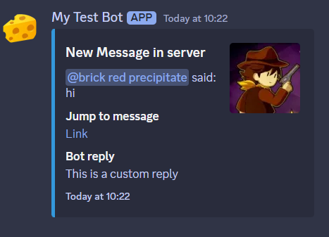
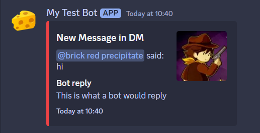
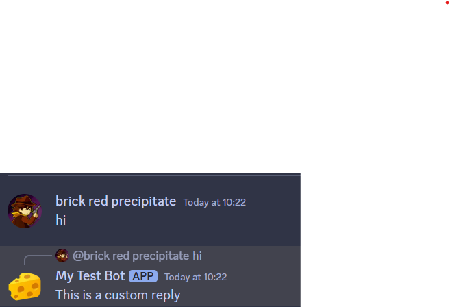
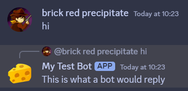

# Discord Bot
This is a starter code for a discord bot. 
> ## 1) How to install this
> 1. Download this file as a zip file
> 2. Remove (example) from .envexample
> 3. Configure the .env file with your own settings
> 4. run the following commands:
>   ```console
>   npm init -y
>   npm install discord.js dotenv fs path
>   node index.js 
>  ```

> ## 2) Features 
> 1. Message logging and reply
> - Here, we haven't implemented AI reply so we are using placeholder text instead
> 
>  
>  
>  - 
>  - 
> - As you can see, the AI can detect messages in both server and direct messages and reply correspondingly as well as log the messages for you to check. The message log channel can be configured by changing the .env `channelID` variable
> 2. Set next meeting time and pinging everyone so they can see it
> - You can set the announcement channel by changing the .env `announcementID` variable
> 
> - 
> - 
